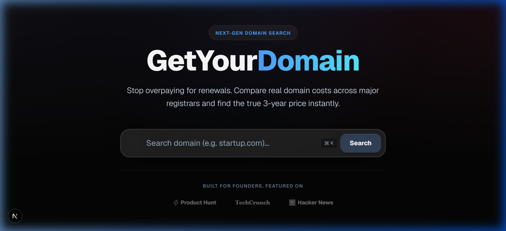
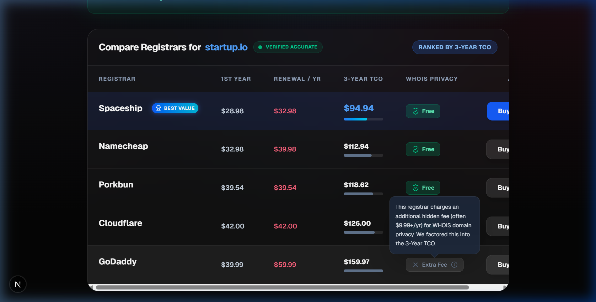

# GetYourDomain

<div align="center">
  
</div>

GetYourDomain is a next-generation domain pricing transparency platform. Stop getting tricked by $0.99 first-year promotional prices. Our tool instantly compares real-time pricing data across top ICANN-accredited registrars and calculates the **true 3-Year Total Cost of Ownership (TCO)**, factoring in hidden fees like WHOIS privacy.

## ✨ Premium Features

- **True 3-Year TCO Calculation:** Ranks registrars by what you'll actually pay over 3 years, not just the first year.
- **Hidden Fees Uncovered:** We automatically factor in hidden WHOIS privacy fees (like GoDaddy's $9.99/yr charge) into the final cost.
- **Real-Time Data:** Prices are verified accurately against top registrars including Namecheap, Porkbun, Spaceship, Cloudflare, and GoDaddy.
- **Glassmorphic Dark Mode UI:** Built with Framer Motion, Tailwind CSS, and a deep space mesh gradient for a buttery-smooth, premium user experience.
- **Interactive Data Visualization:** View animated CSS bar charts that instantly visualize the cost differences between registrars.

## 📸 Screenshots

### Search Results & Interactive Comparisons
<div align="center">
  
</div>

The results page features a high-fidelity shimmer skeleton during loading, a pulsing "Verified Accurate" indicator, and interactive glassmorphic tooltips that explain exactly why certain registrars charge extra fees.

## 🚀 Getting Started

First, install dependencies:

```bash
npm install
```

Then, run the development server:

```bash
npm run dev
```

Open [http://localhost:3000](http://localhost:3000) with your browser to see the result.

## 🛠 Tech Stack
- [Next.js](https://nextjs.org) (App Router)
- [React](https://reactjs.org)
- [Tailwind CSS](https://tailwindcss.com) (v4)
- [Framer Motion](https://www.framer.com/motion/)
- [Lucide Icons](https://lucide.dev)
